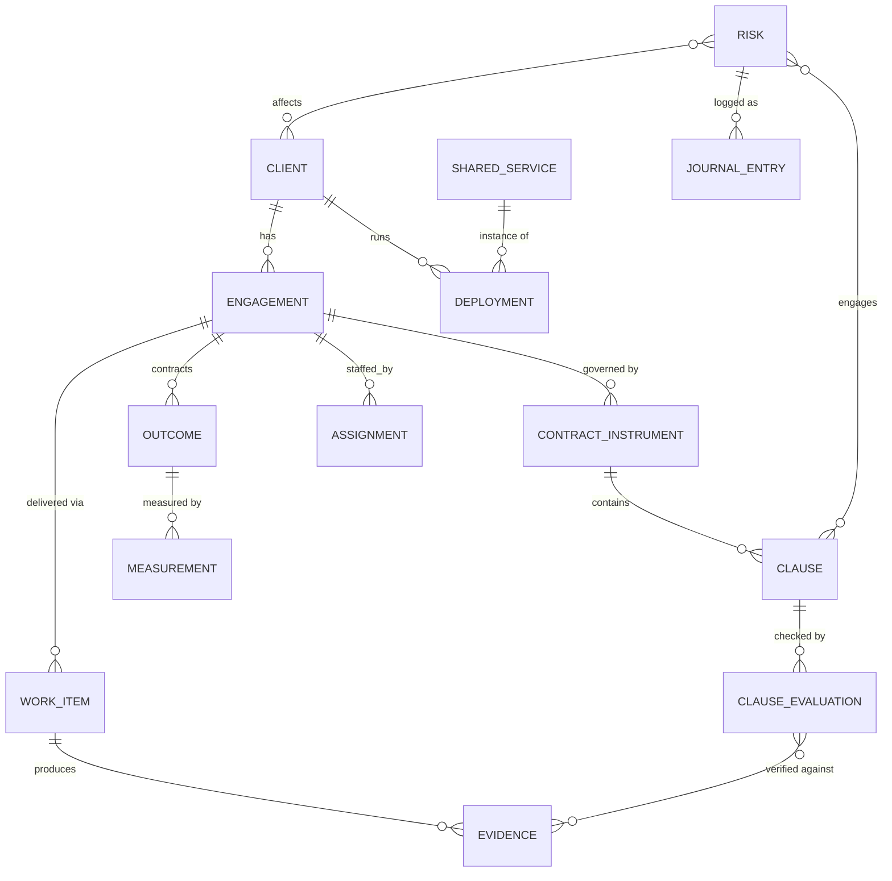

# Meridian — Customer 360 Delivery Assurance Console
## Project Plan v1 · 28 Jul 2026

Grounded in the approved design mock (`Customer 360 Console.dc.html`). The mock commits to five
surfaces — **Customer signal, Customer 360, Correlation, Risk journal, QBR pack** — and this plan works
backwards from them: first the data foundation that makes those screens truthful, then the controls
and risk-analysis capabilities, then the UX build itself.

The console answers one question in two directions:

> **"Is this client on track?"** — and — **"Which of my other clients has the same problem?"**

---

## 1 · Data foundation — combining disparate sources into one layer

Everything on screen is a *claim* (a number, a status, a verdict). The foundational rule: **no claim
without a source record behind it.** The design encodes this literally — every figure carries a
source badge (SALESFORCE / WORKDAY / JIRA / JSM / CONFLUENCE / DRIVE / DERIVED) and the traceability panel shows
the full chain from outcome to evidence.

### 1.1 Source systems and what each contributes

| Source | Domain it owns | Feeds on screen | Freshness target |
|---|---|---|---|
| **Salesforce** | Account, contract instruments (MSA/SOW/call-off/framework), ACV/TCV, change orders, renewal dates, opportunities, CSAT | ACV tiles, vehicle & renewal columns, clause references, renewal runway, CSAT | ≤ 15 min |
| **Workday** | Assignments, utilisation, open roles, attrition flags, burn, margin, continuity | Capacity & team panel, utilisation column, capacity-gap KPI, margin tile | ≤ 2 h |
| **Jira** | Epics, sprints, velocity, blocked age, release/UAT evidence attachments | Velocity sparklines, delivery evidence panel, gate verification, epic list | ≤ 15 min |
| **Jira Service Management** | Service requests, incidents, SLAs, response times, tickets/symptoms (internal service management) | Incident-response outcome, correlated symptoms, SLA clause evidence | ≤ 15 min |
| **Confluence** | Long-form documents: runbooks, decision records, UAT reports, architecture docs — linked as evidence | Evidence links, QBR appendix references, reference remediations | ≤ 1 h |
| **Google Drive** | Client-facing artifacts: signed contracts/COs, benefit-case sign-offs, QBR exports | Signed-evidence verification, artifact completeness checks | ≤ 1 h |
| **Service/deployment inventory** (CMDB or deploy pipeline) | Which shared components run where, at which version, in which environment | Shared-service matrix, blast-radius table, patch windows | ≤ 1 h |
| **Derived** | Outcome index, exposure, share of total ACV, outcome attainment | KPI strip, outcome index tile | computed on refresh |

All connectors are **read-only** against source systems. The only records authored *in* Meridian
are risk-journal entries and QBR narratives — everything else is a projection of source truth.

### 1.2 Ingestion & storage architecture

```
Salesforce ──┐
Workday ─────┤   Connectors        Staging (raw,      Canonical layer        Semantic layer
Jira + JSM ──┼─▶ (poll/CDC/webhook, ▶ immutable,     ▶ (entity resolution, ▶ (derived metrics,   ▶ API ▶ Console
Confluence ──┤   per-source SLA)     source-stamped)   crosswalk, lineage)    clause evaluation,
G. Drive ────┤                                                                correlation engine)
CMDB ────────┘
```

- **Staging** keeps raw payloads immutable and timestamped — this is what lets a QBR claim resolve
  to "the actual Jira attachment, as it existed at generation time".
- **Every canonical record carries provenance**: `source_system`, `source_record_id`,
  `extracted_at`. The UI's "checked 14 min ago" / sidebar source-age dots read straight off this.
- **Freshness is a first-class signal, not plumbing.** If Workday sync is 6 h stale, every
  Workday-badged figure degrades visibly (stale badge), and clause checks that depend on it report
  "evidence stale" rather than silently passing.

### 1.3 Canonical entity model



Key entities and where they come from:

- **Client / Engagement** — Salesforce account + contract hierarchy. One client can have several
  instruments (Northwind = MSA-2023-041 + SOW-14).
- **Contract instrument & Clause** — the "smart contract" layer. Each machine-checkable clause is
  encoded as a spec: `{ref: "§7.2", test: "signed UAT pack + release note within 5 working days of
  gate date", evidence_query: <Jira JQL/attachment predicate>, remedy: {type: milestone_hold,
  amount: £340k}, cadence: 15min}`. Clause text lives in Salesforce/CLM; the executable test is
  authored in Meridian with legal/commercial sign-off (a governed control, see §2).
- **Outcome & Measurement** — contracted outcomes (crash-free rate, telemetry coverage…) with a
  target, a measurement source, and a computation window. Window mismatches are detected, not
  hidden — the mock's "availability figure is 30 days short of the reporting period" flag is a
  measurement-window control firing.
- **Evidence** — UAT packs, release notes, signed benefit cases, Crashlytics exports. An evidence
  record points at a polymorphic artifact reference — a Jira attachment, a Confluence page (with
  version), or a Google Drive file (with revision) — and has a verification state
  (`attached / verified / missing / stale`). **Missing evidence is a first-class negative record**
  — it's what auto-fails gates and flags QBR claims.
- **Deployment / Shared service** — the correlation backbone: which client runs which version of
  which shared component in which environment (prod/staging, internet-facing or not).
- **Risk & Journal entry** — authored in Meridian, append-only (immutable log), linked to clients,
  clauses, work items, and clusters.

### 1.4 Identity resolution (the crosswalk)

The single hardest data problem: `Salesforce Account 0015f…` = `Workday project NWR-DELIV` =
`Jira project NWR` = `JSM organization Northwind` = `Confluence space NWR` = `Drive folder Northwind Rail`
= `CMDB org northwind-rail`. Plan:

1. Seed a **crosswalk table** manually for the initial 8–15 accounts per CSM (cheap, accurate).
2. Add match-confidence scoring for new engagements (name, domain, contract references).
3. **Unmapped records are surfaced as a data-quality queue, never silently dropped** — an
   unmapped Jira project means delivery evidence is invisible, which is itself a risk.

### 1.5 Derived/semantic layer

Deterministic, versioned, and explainable computations — each with a definition page reachable
from its badge:

- **Outcome index** (0–100 per engagement) — weighted attainment across contracted outcomes.
- **Exposure** — ACV at risk + live clause remedies (credits, held milestones, uncapped terms
  weighted worst-case).
- **Health band** (On track / Watch / At risk) — rule-based composite over outcomes, clauses,
  capacity, velocity trend, renewal proximity. Rules, not ML, in v1 — a CSM must be able to defend
  the band in front of a client.

---

## 2 · Controls across functions

The platform's job is not dashboards — it's **controls**: automated checks that fire before a human
would have caught the problem. Catalogue, by function:

### 2.1 Commercial / contract controls (Smart contract monitor)
| Control | Test | Fires as |
|---|---|---|
| Milestone gate | Required evidence attached + verified within N days of gate date | **BREACH** → milestone payment flagged held (§7.2, £340k) |
| SLA / availability | Rolling window vs threshold, credit tiers | **AT RISK** at early-warning band, **BREACH** at credit trigger (§4.1) |
| Change control | Any scope variation > £X has signed CO before work logged against it | Jira burn against unsigned scope → alert |
| Security remediation window | Critical CVE patched within N days of disclosure | Countdown per client (§6.3 "day 3 of 14") |
| Key personnel continuity | Named roles ≥ X% continuity per quarter (Workday) | Watch/breach |
| Reporting cadence | Monthly report delivered by Nth working day | Watch/breach |

Clause specs are **governed artifacts**: authored in Meridian, reviewed by commercial/legal,
versioned, with an audit trail of who changed which test when.

### 2.2 Delivery controls
- **Missing-artifact detection** — the flagship control. Contract type ⇒ required-artifact
  checklist (UAT pack, release note, signed benefit case, DPIA, runbook…). Absence within its
  window raises a risk automatically; nobody has to notice.
- Blocked-age thresholds on gate-critical epics (NWR-482 at 9 days ⇒ escalation).
- Velocity-trend alerting (−12% vs 6-sprint mean) *only when correlated* with an at-risk outcome
  or clause — activity metrics never alarm on their own (the design's core bet: outcomes over
  activity).

### 2.3 Capacity & people controls (Workday)
- Sustained over-utilisation (>100% for N weeks) — burnout/attrition predictor.
- Margin erosion vs plan beyond tolerance (18% plan → 11% actual).
- Open roles > 30 days on delivery-critical positions; attrition flags on named/key personnel
  (feeds §continuity clause).

### 2.4 Customer-success / commercial-motion controls
- **Renewal runway**: contract end date with no open renewal opportunity inside the motion window
  (Solent Marine: expiry in 64 days, no opportunity, CSAT falling) — auto-raises a P1.
- CSAT trend break combined with outcome shortfall.
- QBR cadence: due dates computed from contract terms; overdue QBR is itself a flagged risk.

### 2.5 QBR automation (assembled from source systems, zero manual entry)
Pipeline: **assemble → lint → narrate → review → share**.

1. **Assemble** — standard pack structure (exec summary, commercial position, outcome performance,
   clause status, risk & recovery, capacity & margin, roadmap) populated entirely from the
   canonical layer; every figure carries its source badge and record reference.
2. **Claim linting** — every claim is validated before a human sees it:
   - *Window checks*: measurement period matches reporting period (catches "99.1% is 30-day, the
     period is 91 days").
   - *Verification checks*: cited evidence must be in `verified` state (catches "Gate 3 slide cites
     unverified evidence").
   - Failed claims are **flagged in place**, never silently dropped or "fixed".
3. **Narrative drafting** — generated from the risk journal (root causes, recovery plans, and
   agreed dates already live there), then human-edited. The journal is the narrative's source of
   truth, which is why journal hygiene is a control too.
4. **Review gate** — a QBR with open claim flags cannot be shared with the client until flags are
   resolved or explicitly waived (waiver is journaled).
5. **Export/share** — PDF export and client-share, both watermarked with generation time and data
   freshness.

### 2.6 Risk journal as the control spine
Append-only, immutable log. Every control that fires writes an entry; every entry links to its
evidence (clause refs, Jira keys, CVE ids, cluster ids), carries state movement (New → Watch →
Breach/Escalated → Closed), an owner, and a due date. This gives audit, QBR narrative, and
escalation one shared substrate.

---

## 3 · Risk analysis & cross-customer correlation — "customer A raised it; who else is exposed?"

This is the differentiating capability, and it needs two graphs the foundation must maintain:

### 3.1 The service-inventory graph (how clients use the platform)
`SHARED_SERVICE → version → DEPLOYMENT (client, environment, exposure)` — kept fresh from
CMDB/deploy pipelines. This is the matrix view in the design: for each shared component, per
client: **vulnerable / version-drift / patched / not deployed**. Version drift is tracked
continuously, not just during incidents — drift *is* latent blast radius.

### 3.2 The symptom/issue graph
Tickets, incidents, and journal entries normalised into a shared taxonomy and clustered:
- **Signature matching** — error patterns, component references, timing correlation ("p99 up 4× on
  two clients within 40 minutes").
- **Taxonomy normalisation** — the design calls out that two clients logged the same defect as
  "performance" and one as "security"; clustering must survive that drift, so match on symptom
  fingerprints, not client-chosen categories.

### 3.3 The correlation workflow (the loop to build)
When client A raises an issue (ticket, CVE disclosure, incident, or a CSM-raised risk):

1. **Identify the shared asset** — map the issue to component + version via the service graph.
2. **Compute technical blast radius** — all clients running affected versions, split
   *impacted* (vulnerable version, exposed environment) vs *potentially impacted* (staging-only,
   indirect, version-drift toward the affected range).
3. **Re-score contractually** — this is the step nobody else does: for each affected client,
   intersect exposure with their clause set. Remediation windows (§6.3), change-notice obligations
   (§8.1 GxP), release freezes (§11.2), uncapped credits. The output is *liability-ranked*, not
   CVSS-ranked.
4. **Sweep for correlated symptoms** — pull matching tickets from potentially-impacted clients who
   haven't connected their symptom to the cause yet (Kestrel's 3 malformed-payload tickets).
5. **Open a cross-customer cluster** — one cluster id, one journal entry spanning N customers, exposure summed.
6. **Recommend a sequenced action** — constraint-solve over patch windows, clause deadlines,
   freezes, and released capacity ("Halcyon first: uncapped credit + shortest window; Castellan
   third: freeze holds until 14 Aug"). Also harvest the *reference remediation* from any client
   already clean (Castellan's runbook).
7. **Act & notify** — schedule the wave, notify affected clients, track per-client countdowns
   against their own contractual windows.

v1 scope honesty: steps 1–3 and 5 automated; step 4 assisted (candidate matches proposed, human
confirms); step 6 recommended, human-approved. Full auto-clustering is a later phase.

---

## 4 · UX & experience plan

### 4.1 Design principles (locked in the mock — treat as build acceptance criteria)
1. **Outcomes and clauses lead; activity supports.** A green burndown next to a breached gate is
   the exact failure this product exists to prevent. No screen may show delivery activity without
   its contractual context.
2. **Every figure traces to a source in one click.** Source badge → provenance popover → source
   record deep-link. This is what makes the QBR defensible in the room.
3. **The customer overview is a triage surface, not a report.** Ranked by exposure; the four highest-stakes
   actions ("Needs a decision today") are actionable without opening the account.
4. **Correlation is a first-class view**, one click from the persistent customer-signal banner.
5. **Dense instrument panel** — a screen kept open all day. Light default, dark toggle; IBM Plex
   Mono for data, Instrument Sans for prose; the established tone system (good/warn/crit) is the
   only status vocabulary.

### 4.2 The five surfaces and their jobs
| Surface | Job | Key interactions |
|---|---|---|
| **Customer signal** | Morning triage: where do I spend today? | Sort by exposure · risk lens · row → Customer 360 · decision-queue actions · renewal runway |
| **Client 360** | Is this client on track, and can I prove it? | Outcome vs clause side-by-side · capacity & margin · delivery evidence · traceability chains · BUILD QBR |
| **Correlation** | Who else has this problem, and what's the one right action? | Blast-radius table (liability-ranked) · shared-service matrix · correlated symptoms · schedule wave / notify clients |
| **Risk journal** | Immutable record + working queue | Filters (critical / clause-linked / mine) · state movement · linked evidence chips |
| **QBR pack** | Client-ready story, zero manual assembly | Page nav with flag badges · in-place claim flags · review-both gate · export/share |

### 4.3 Primary user loops (design & test end-to-end, in this order)
1. **Daily triage loop** (CSM, many times/day): portfolio KPI strip → decision queue → act or drill in.
2. **Incident/correlation loop** (event-driven): customer-signal banner → TRIAGE → blast radius →
   schedule wave → notify → journal entry auto-created → per-client countdowns.
3. **QBR loop** (quarterly per account): BUILD QBR → resolve claim flags → edit narrative →
   export/share. Target: hours → minutes, with *higher* claim integrity than manual packs.
4. **Renewal loop** (background): runway alerts → renewal motion → outcome/CSAT evidence reused
   from the same layer.

### 4.4 States the mock doesn't show (must be designed before build)
- **Degraded sources** — stale badges, per-source outage banner, clause checks reporting
  "cannot evaluate — evidence stale" (fail-visible, never fail-silent).
- **Empty/onboarding** — a new engagement before clause encoding and crosswalk mapping is done;
  show setup completeness as a checklist (itself a control).
- **Roles & permissions** — CSM (author risks, build QBRs, own accounts), delivery lead
  (evidence & epics), sector partner (portfolio read + escalations), commercial/legal (clause spec
  approval), client-shared views (QBR export only, no cross-customer data). Cross-customer correlation reveals
  cross-client data — internal-only, permission-gated, and client identities in shared artifacts
  are the CSM's explicit choice.
- **Notifications** — decision-queue items and countdown breaches push (email/Slack) with
  deep-links; everything else stays in-console.
- **Accessibility** — tone colors always paired with text labels (already true in the mock:
  BREACH/AT RISK/MET), keyboard-first ⌘K navigation, WCAG AA contrast in both themes.

---

## 5 · Delivery roadmap

**Phase 0 · Foundation spike (2–3 wks)** — connectors for Salesforce + Jira + Workday against one
real account; crosswalk seeded; staging + canonical layer stood up; one clause (§7.2 milestone
gate) evaluated end-to-end against real evidence. *Exit: a real breach detectable from real data.*

**Phase 1 · Client 360 (4–6 wks)** — full canonical model for the pilot CSM's 8 accounts; outcome
measurements + 6-clause monitor per account; capacity panel; delivery evidence; traceability
chains; risk journal (author + immutable log). *Exit: pilot CSM runs one account entirely from
Meridian for two weeks.*

**Phase 2 · Customer signal (3–4 wks)** — derived layer (health bands, outcome index, exposure);
customer table + KPI strip; decision queue fed by live controls; renewal runway control. *Exit: the
decision queue surfaces a real issue before the CSM knew about it.*

**Phase 3 · QBR automation (3–4 wks)** — pack assembly, claim linting (window + verification
checks), journal-drafted narrative, review gate, export/share. *Exit: one real QBR delivered to a
client from a generated pack; assembly time and flag-catch count measured.*

**Phase 4 · Correlation (4–6 wks)** — service-inventory graph + version-drift tracking; blast
radius with contractual re-scoring; assisted symptom clustering; cross-customer clusters in the journal;
recommended-action sequencing; customer-signal banner. *Exit: replay of a historical incident
(CVE-style) identifies all actually-affected clients plus at least one potentially-affected client
that was missed at the time.*

Cross-cutting from Phase 0: provenance on every record, freshness surfacing, permissions,
clause-spec governance.

### Success metrics
- Time from issue-raised-by-client-A → all impacted clients identified (target: < 1 h, from days).
- QBR assembly effort (target: < 30 min human time) and claim-lint catches per pack.
- % of breaches detected by a control before a human raised them.
- Decision-queue precision: fraction of surfaced decisions the CSM acts on.

### Top risks to the plan
1. **Crosswalk quality** — wrong identity mapping poisons everything downstream. Mitigate: manual
   seed, confidence scoring, visible unmapped-record queue.
2. **Clause encodability** — some clauses resist machine-checkable tests. Mitigate: triage clauses
   into auto / assisted / manual-attest tiers; don't fake automation.
3. **Evidence discipline in source systems** — if UAT packs aren't attached in Jira, gates can't
   verify. Mitigate: the missing-artifact control *is* the adoption lever — it nags where the work
   already happens.
4. **Cross-client data sensitivity** — correlation view exposes one client's incident to another
   client's team internally. Mitigate: permission gating + redaction rules in anything exportable.
5. **Trust in derived numbers** — one wrong health band destroys credibility. Mitigate: rules not
   ML in v1, definition pages behind every derived badge, provenance everywhere.
